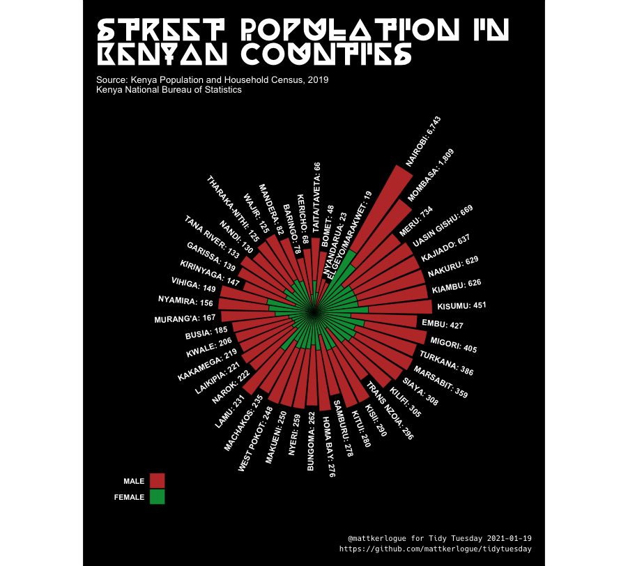
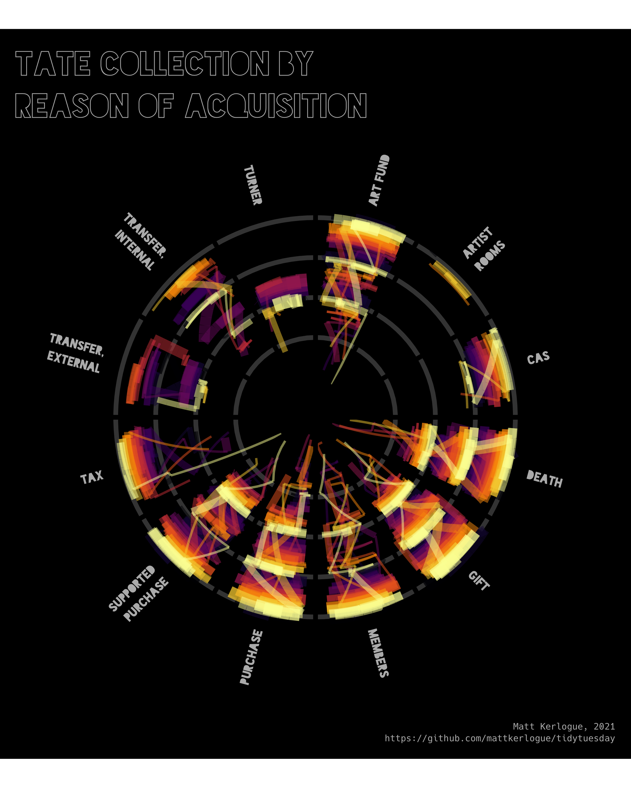

# tidytuesday
A repo for storing [tidytuesday](https://github.com/rfordatascience/tidytuesday) analysis.

### 2021-01-19: 2019 Kenya Census

Script: [2021/2021-01-19_kenya_census.R](2021/2021-01-12_kenya_census.R)

Output: Visualisation of street population counts in Kenya by county, from the 2019 Kenyan Population and Household Census, Kenya Bureau of Statistics via Shelmith Kariuki's [`rKenyaCensus`](https://github.com/Shelmith-Kariuki/rKenyaCensus).

The resulting plot uses the colours of the Kenyan flag for its colour palette and the [Charvet font](http://www.thisisthenest.com/charveta-typeface-2013) by Kevin Karanja for the plot title.

### 2021-01-12: Tate Collection

Script: [2021/2021-01-12_tate_collection.R](2021/2021-01-12_tate_collection.R)

Blog post: 

Output: Visualisation of the Tate Collection by reason of acquisition and year of artwork.

