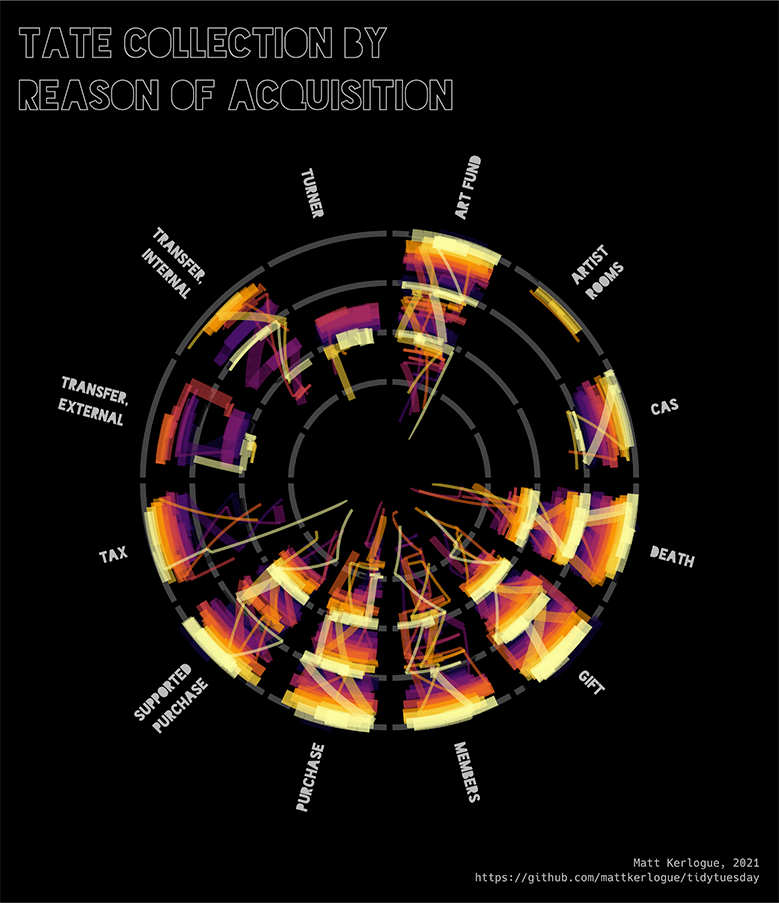

# tidytuesday
A repo for storing tidytuesday analysis

### 2021-01-12: Tate Collection

Script: 2021/2021-01-12_tate_collection.R

Output: Visualisation of the Tate Collection by reason of acquisition.

The `creditLine` variable in the `artwork` dataset was re-coded to generate reasons for acquisition:

* `art fund` - purchases assisted by the [Art Fund](https://www.artfund.org)
* `artist rooms` - works in the [ARTIST ROOMS](https://www.tate.org.uk/artist-rooms) collection
* `cas` - purchases assisted by the [Contemporary Art Society](http://contemporaryartsociety.org)
* `death` - acquisitions due to death, e.g. bequeathed in a will, donated in memory of an individual, or purchases via a legacy
* `gift` - artworks given as a gift to the Tate
* `members` - artworks purchases made by the [Tate Members/Friends of the Tate](https://www.tate.org.uk/join-support/tate-members/five-ways-members-make-difference), [Patrons](https://www.tate.org.uk/join-support/tate-patrons)
* `purchase` - outright purchases from the Tate's general funds
* `supported purchase` - purchases supported by another institution
* `tax` - artworks given to the nation in lieu of tax payments
* `transfer, external` - artworks transferred from other institutions
* `transfer, internal` - artworks transferred from the library, archive or reference collection
* `turner` - artworks from the [Turner Bequest](https://www.nationalgallery.org.uk/about-us/history/the-turner-bequest)

The number of works by reason for acquisition and year of painting was then plotted.

